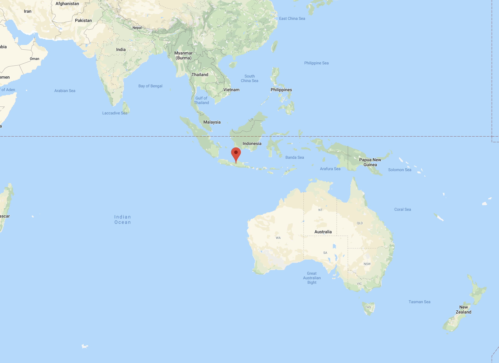
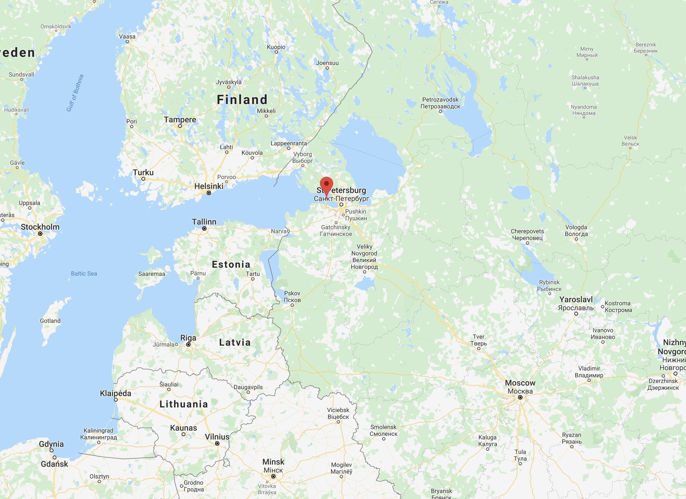
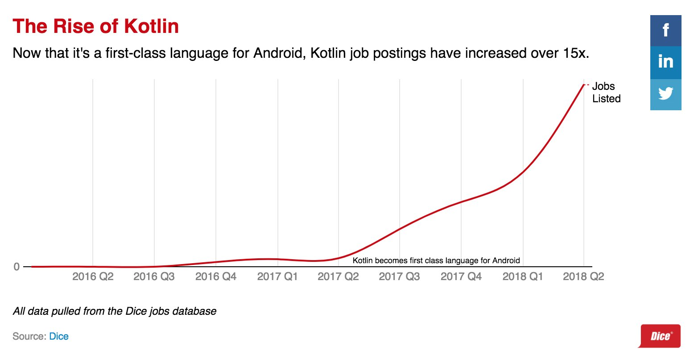
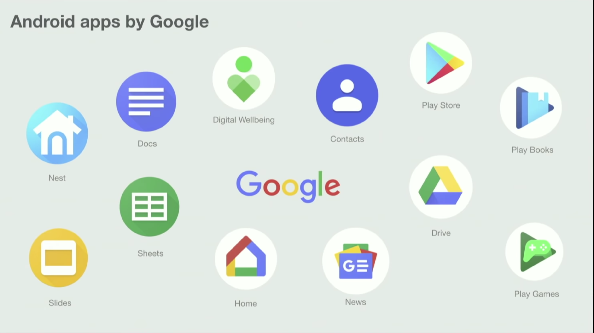
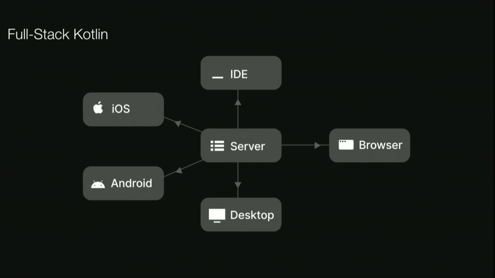
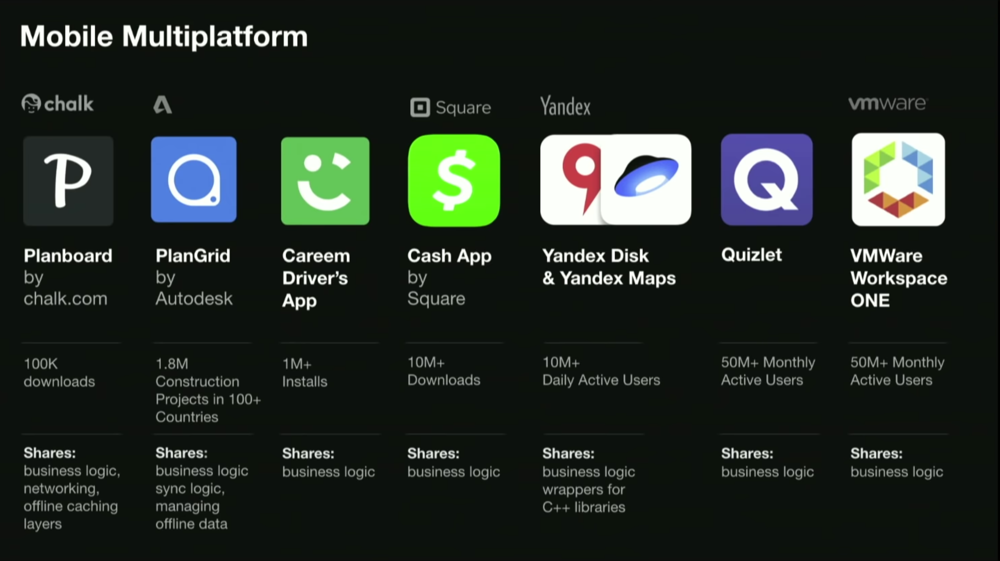

## JAVA

## Kotlin

## Qué es Kotlin

* Lenguage de la JVM ( también Js y Nativo)
* De propósito General
* Orientado a Objetos
* Estáticamente Tipado
* Multiplataforma
* Desarrollado por JetBrains desde 2010
 

## Características   

* Funcional
* Inferencia de Tipo
* Soporte para evitar NullPointerException
* Soporte Inmutabilidad   
* Menos Ceremonial
    * Menos código, mas resultados
    * Codigo más limpio
* Es un mejor Java

## JetBrains

## Buscando un nuevo lenguaje

* Conciso
* Expresivo
* Interoperable
* Pragmático

## Candidatos

* Scala
    * compilación lenta
	* no es fácil de aprender
	* no es fácil de mantener 
    

## Evolution de Kotlin

* July 2011, Kotlin unveiled by JetBrains
* February 2012, Kotlin Open Sourced under apache 2
* February 2016, Kotlin v1.0, released
* May 2017, Google I/O, Kotlin was adopted by Android officially.
* Nov 2017 Kotlin 1.2, Kotlin/JS
* Oct 2018 Kotlin 1.3, Coroutines
* Primavera 2020 Kotlin 1.4

## Kotlin Popularity

## Kotlin Jobs

## Apps Build on Kotlin

60% de las Top 100 apps en Android son construidas con kotlin

## Todo Tipo de Aplicaciones

* ServerSide (Spring Boot, Micronaut, Ktor)
* Android Development
* Web Development Kotlin/Js
* DeskTop Applications, JavaFX y TornadoFx
* Native Development ( Kotlin/Native Library)
* Data Science ( Jupiter Notebooks) 

## FullStack

## Multiplataforma

## Let's Code!!!!

https://play.kotlinlang.org/
