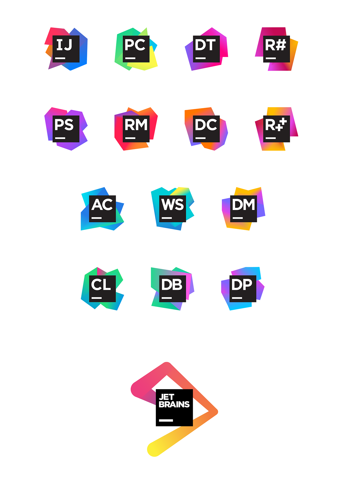
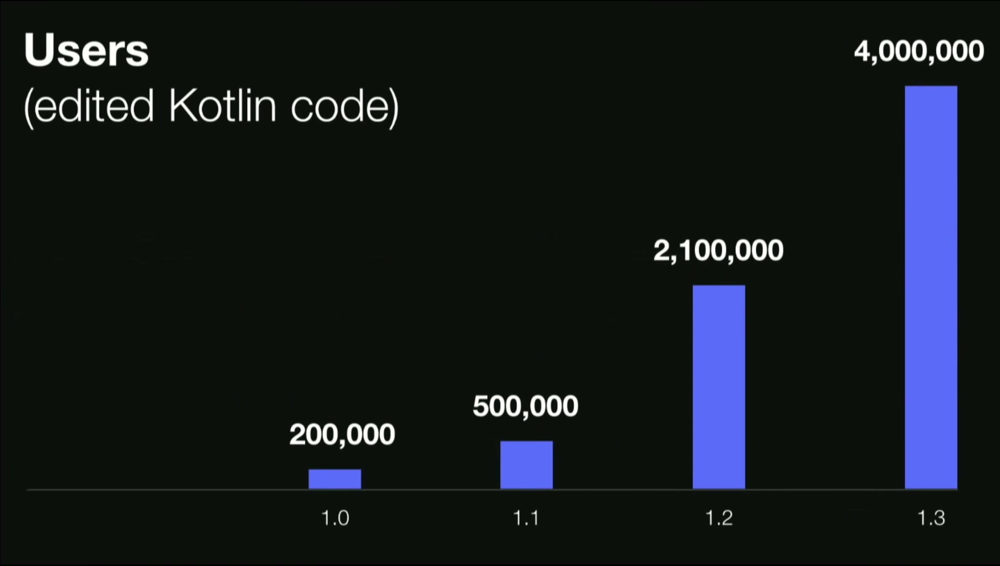

## Kotlin OverView

* Lenguage de la JVM ( como Java, Scala, Groovy) 
* Lenguage Orientado a Objetos
* Estáticamente Tipado
* Desarrollado por JetBrains desde 2010
* Es un mejor Java

## Kotlin OverView 2  

* Funcional
* Menos Ceremonial
    * Menos código, mas resultados
    * Codigo más limpio
* Soporte para evitar NullPointerException
* Soporte Inmutabilidad inmutability  

## JetBrains

## Evolution de Kotlin

## Kotlin Popularity

## Apps Build on Kotlin

60% de las Top 100 apps en Android son construidas con kotlin

## Tipo de Aplicaciones que se pueden construir

* ServerSide
* Android Development
* Web Development Kotlin/Js
* DeskTop Applications, JavaFX y TornadoFx
* Native Development ( Kotlin/Native Library)
* Data Science ( Jupiter Notebooks) 
