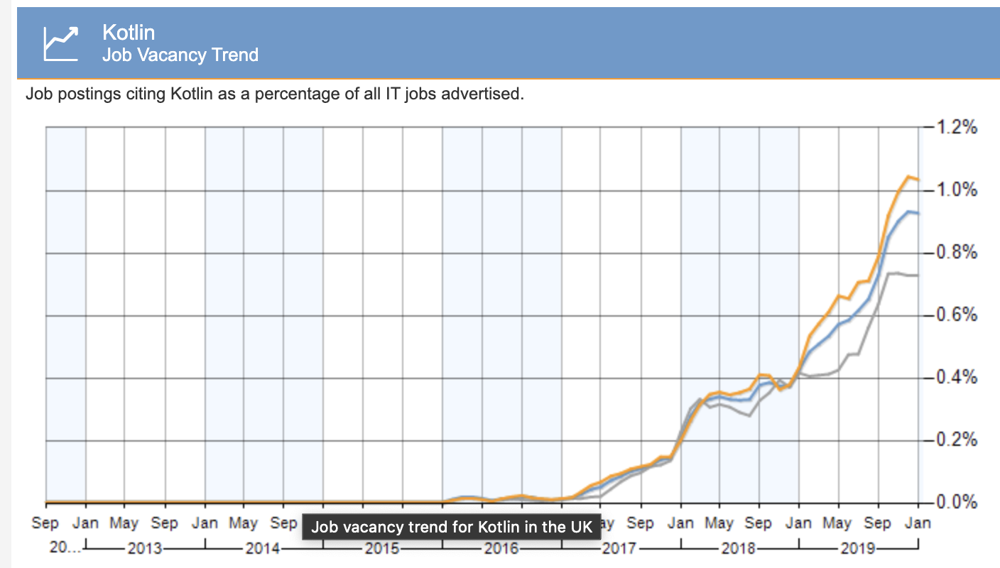
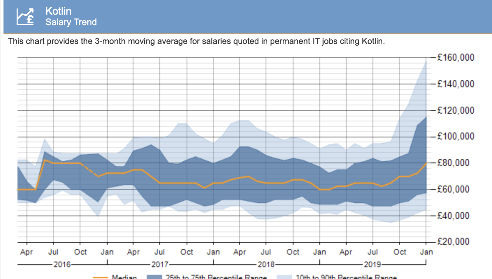
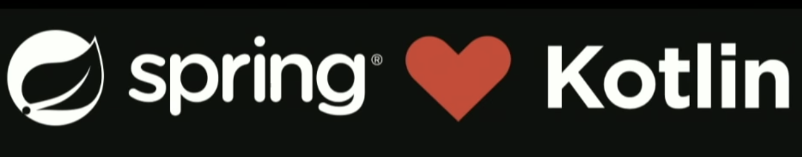
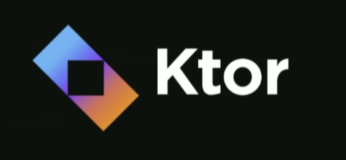
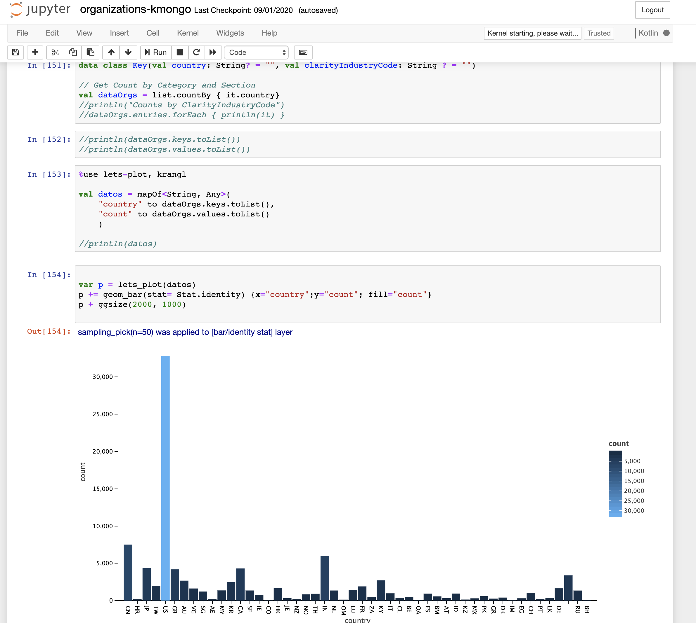

## JAVA

## Kotlin

## What is Kotlin

* JVM  Language ( also JS and Native)
* General Purpose
* Object Oriented
* Statically Typed
* MultiPlatform
* Developed by JetBrains since 2010

<!-- .element height="40%" width="50%" -->

Note: y quienes son estos tios de JetBrains?

## Looking a better language 

* More concise
* Expresive
* Interoperable
* Pragmatic

## Why not Scala?

* slow compilation
* not easy to learn
* not easy to maintain

Note: Scala era un buen candidato para que JetBrains lo usara como su plantaforma principal de desarrollo, sin embargo, Scala tiene sus propios problemas es un lenguaje con compilacion lenta, no es facil de aprender la curva la aprendizaje es lenta y no es nada facil de mantener, asi que en el 2010 JetBrains decide desarrollar un lenguaje propio que les permita  aprovechar que Java se estaba quedando algo viejuno, Oracle no estaba reaccionando de forma rápida en la evoluciñon del lenguaje y habia una percepción de que Java se estaba quedando como un lenguage obsoleto...algo viejo. y desde entonces esta es la evolución. 

* Functional 
* Type Inference
* Support to Avoid NullPointerException
* Support for Inmutability   
* Less Ceremonial
    * Less Code, more results
    * Code more Clean
* A better Java

## Evolution of Kotlin

* July 2011, Kotlin unveiled by JetBrains
* February 2012, Kotlin Open Sourced under apache 2
* February 2016, Kotlin v1.0, released
* May 2017, Google I/O, Kotlin was adopted by Android officially.
* Nov 2017 Kotlin 1.2, Kotlin/JS
* Oct 2018 Kotlin 1.3, Coroutines
* ....Spring 2020 Kotlin 1.4

## Kotlin Popularity

## Kotlin Jobs

<!-- .element height="40%" width="45%" style="float:left; padding:0px" -->
<!-- .element height="40%" width="45%" style="float:right; padding:0px" -->

## Apps Build on Kotlin

60% de las Top 100 apps en Android son construidas con kotlin

## but not only Android....

## Server-Side

<!-- .element height="40%" width="40%" style="float:left; padding:10px" -->
<!-- .element height="25%" width="25%" style="float:right; padding:10px"-->
<!-- .element height="40%" width="40%" style="float:left; padding:10px"-->
<!-- .element height="40%" width="40%" style="float:right; padding:10px"-->

<!-- .element height="80%" width="80%"-->

## Web Development Kotlin/Js

## DeskTop Applications, JavaFX y TornadoFx

## Native Development/MultiPlatform

<!-- .element height="60%" width="60%" style="float:right; padding:0px"-->
* IOS
* Android
* MacOs
* Linux
* JVM
* Windows
* Rapsberry Pi

## Data Science 

<!-- .element height="100%" width="60%" style="float:right; padding:0px"-->
* Data engineering
* Data analysis
* Machine learning
* Visualization

## FullStack

## Let's Code!!!!

https://play.kotlinlang.org/
